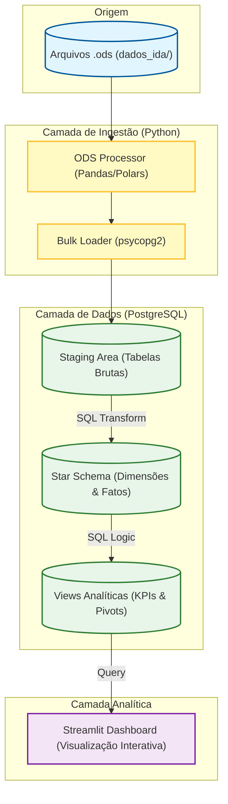

# Case Técnico: Data Mart IDA Anatel

## Visão Geral
Este projeto implementa uma solução de Engenharia de Dados ponta a ponta para a ingestão, tratamento e modelagem analítica dos dados do **Índice de Desempenho no Atendimento (IDA)** da Anatel. A solução automatiza a extração de arquivos OpenDocument (.ods), normaliza estruturas variadas através de processamento Python e consolida as métricas em um Data Mart PostgreSQL seguindo o modelo dimensional (Star Schema).

## Execução

A solução é totalmente conteinerizada via Docker. Siga os passos abaixo:

0. **Clonar o repositório**:
   ```bash
   git clone https://github.com/euvanessa-prado/beanalytic_case_ida_anatel.git
   cd beanalytic_case_ida_anatel
   ```

1. **Pré-requisitos**:
   - Docker e Docker Compose instalados.

2. **Subir tudo (um comando)**:
   ```bash
   docker compose up -d --build
   ```
   - O parâmetro `--build` garante que qualquer alteração recente no código seja incorporada à imagem.
   - As configurações usam valores padrão seguros (banco local), mas podem ser sobrescritas via `.env` se necessário.
   - Após remover volumes (reset), os dados são recarregados automaticamente pelo ETL.

3. **Acesso e Credenciais**:
   - **Dashboard (Streamlit)**: [http://localhost:8501](http://localhost:8501)
   - **Banco de Dados (PostgreSQL)**:
     - **Host**: `localhost` (porta 5432)
     - **Database**: `ida_datamart`
     - **User**: `postgres`
     - **Password**: `postgres`
   - **Administração (PgAdmin)**:
     - **Link**: [http://localhost:5050](http://localhost:5050)
     - **Email**: `admin@admin.com`
     - **Senha**: `admin`
     - *Dica: Para conectar ao banco no PgAdmin, use o host `postgres` (nome do container).*
   - **Conexão Externa (DBeaver/PowerBI)**:
     - Utilize as mesmas credenciais do PostgreSQL acima. O host é `localhost` pois a porta 5432 está exposta.
   
   > **Nota para o Avaliador:** As credenciais são padrão (`postgres`/`postgres`) para facilitar a execução local do teste técnico. Em produção, utilizaríamos variáveis de ambiente seguras (Secrets).

4. **Fluxo Automático**:
   - O banco PostgreSQL é inicializado com o schema base.
   - O container `data_loader` aguarda o banco estar `healthy`.
   - Inicia o processamento dos arquivos presentes em `dados_ida/`.
   - Executa as transformações SQL para carga da Fato e criação das Views:
     - [01_transform_load.sql](sql/01_transform_load.sql)
    - [view_taxa_resolucao_5_dias.sql](sql/view_taxa_resolucao_5_dias.sql)

5. **Ver logs rapidamente**:
   ```bash
   docker compose logs -f data_loader
   ```
   - Aguarde a mensagem: `ETL concluído com sucesso`.

6. **Reset opcional (apagar dados e subir limpo)**:
   ```bash
   docker compose down -v && docker compose up -d
   ```
   - O ETL recria o Data Mart automaticamente.

### Evidência de Execução
- ETL concluído com sucesso:


- Docker em execução:


Caso prefira outro nome, ajuste o caminho da imagem conforme necessário em `assets/`.

### Métricas Principais
- **Taxa de Variação Individual**: Evolução percentual do IDA de uma operadora.
- **Benchmarking de Mercado**: Comparação da variação individual contra a média do setor.
- **Métrica de Agilidade**: Taxa de resolvidas em até 5 dias úteis.

## Arquitetura da Solução



### 1. Camada de Ingestão (Python + Polars)
- **ODS Processor**: Motor modernizado que utiliza `pandas`/`odfpy` para leitura inicial e **Polars** para transformação massiva.
- **Parquet Cache**: Implementação de cache local em formato **Parquet** para acelerar reprocessamentos.
- **Normalização**: Conversão eficiente de tabelas wide para long format usando a engine Rust do Polars.
- **Bulk Loading**: Persistência otimizada na Staging via `psycopg2.extras.execute_values`.

### 2. Camada de Dados (PostgreSQL)
- **Staging**: Camada temporária para persistência dos dados brutos normalizados.
- **Trusted/Refined (Dimensional)**:
    - `dim_tempo`: Dimensão temporal com atributos de calendário.
    - `dim_grupo_economico`: Cadastro único de operadoras.
    - `dim_servico`: Classificação dos serviços de telecomunicação.
    - `fato_ida`: Tabela fato contendo métricas de agilidade (5 dias), resolução total e volumes de solicitações.

### 3. Camada Analítica (SQL)
- **View Pivotada**: Implementação de SQL dinâmico para gerar relatórios de variação percentual mês a mês, permitindo comparação direta entre o desempenho individual das operadoras e a média do mercado.
- **Dashboard Interativo**: Interface gráfica desenvolvida em **Streamlit** para visualização amigável dos dados, permitindo análises de tendência e heatmaps comparativos.

## Estrutura do Projeto
- `/sql`: Scripts de DDL, Transformação e Views.
- `/src`: Módulos Python (Normalização e Carregamento).
- `/dados_ida`: Repositório de arquivos brutos (.ods).
- `docker-compose.yml`: Orquestração da infraestrutura.
- `/assets`: Recursos gráficos do dashboard.

## Ferramentas e Bibliotecas
- Linguagem: Python 3.11.12
- Banco: PostgreSQL 17.5
- Orquestração: Docker Compose
- Frontend: Streamlit
- Visualização: Plotly
- Bibliotecas Python:
  - **polars** (processamento de dados de alta performance)
  - pandas, odfpy (leitura de ODS)
  - psycopg2-binary (PostgreSQL)
  - python-dotenv (configuração)
  - plotly (visualização de dados)
  - streamlit (interface web)
  - requests (requisições HTTP)

 

## Detalhes do ETL

### Passo a Passo
- Ler ODS de `dados_ida/` e normalizar para long-format: [ods_processor.py](src/ods_processor.py)
- Carregar em lote para `ida.staging_ida`: [staging_loader.py](src/staging_loader.py)
- Consolidar dimensões e fato: [01_transform_load.sql](sql/01_transform_load.sql)
- Construir view de variação pivoteada: [view_taxa_resolucao_5_dias.sql](sql/view_taxa_resolucao_5_dias.sql)
- Exibir no dashboard (tema escuro, filtros na lateral, KPIs dinâmicos): [dashboard.py](src/dashboard.py)

### Sequência dos Scripts
1. Inicialização do schema e tabelas:
   - [00_init_completo.sql](sql/00_init_completo.sql)
2. Transformação e carga para o modelo estrela:
   - [01_transform_load.sql](sql/01_transform_load.sql)
3. Camada analítica (view com variação e pivô):
   - [view_taxa_resolucao_5_dias.sql](sql/view_taxa_resolucao_5_dias.sql)
4. Orquestração e chamada dos scripts (Python):
   - [carregar_dados_no_postgres.py](carregar_dados_no_postgres.py#L42-L99)

## Validações e Troubleshooting

### Validações Úteis
- Contagens rápidas (após carga):
  ```bash
  docker compose exec postgres psql -U postgres -d ida_datamart -c "SELECT COUNT(*) FROM ida.fato_ida;"
  docker compose exec postgres psql -U postgres -d ida_datamart -c "SELECT COUNT(*) FROM ida.view_taxa_resolucao_5_dias;"
  ```

### Troubleshooting
- Mensagem “Inicialização em andamento” no dashboard:
  - O ETL ainda está criando a view; aguarde “ETL completed successfully” nos logs e recarregue a página.
- Reconstruir tudo do zero:
  - `docker compose down -v && docker compose up -d`
- Logs do ETL:
  - `docker compose logs -f data_loader`

## Objetos de Avaliação (Prova Técnica)
- O projeto roda integralmente com `docker compose up` (infra + ETL + dashboard).
- SQL: organização, clareza e documentação usando `COMMENT ON`.
- Python: organização, clareza, docstrings (pydoc) e uso de OOP.
- Sem dependência de scripts externos; instruções mínimas e diretas.

## Roadmap de Profissionalização
- Opcional: integrar dbt para materializar dim/fato/view com testes e documentação.
- Adicionar CI com lint/testes de import (GitHub Actions).

## Transformações com dbt (opcional)
- Projeto dbt incluído em `/dbt` (models para dim_tempo, dim_grupo_economico, dim_servico e fato_ida).
- Executar dbt via Compose perfil “analytics”:
  ```bash
  docker compose --profile analytics up dbt
  ```
  ou em execução pontual:
  ```bash
  docker compose run --rm dbt bash -lc "dbt run && dbt test"
  ```
- Conexão configurada em `/dbt/profiles.yml` para o Postgres do Compose.
- Modelo analítico “long_delta” para variação mensal e diferença (mercado vs individual).
